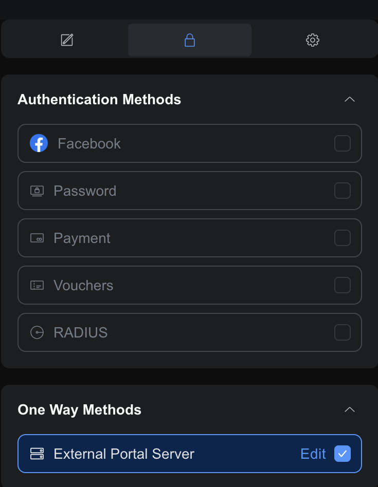
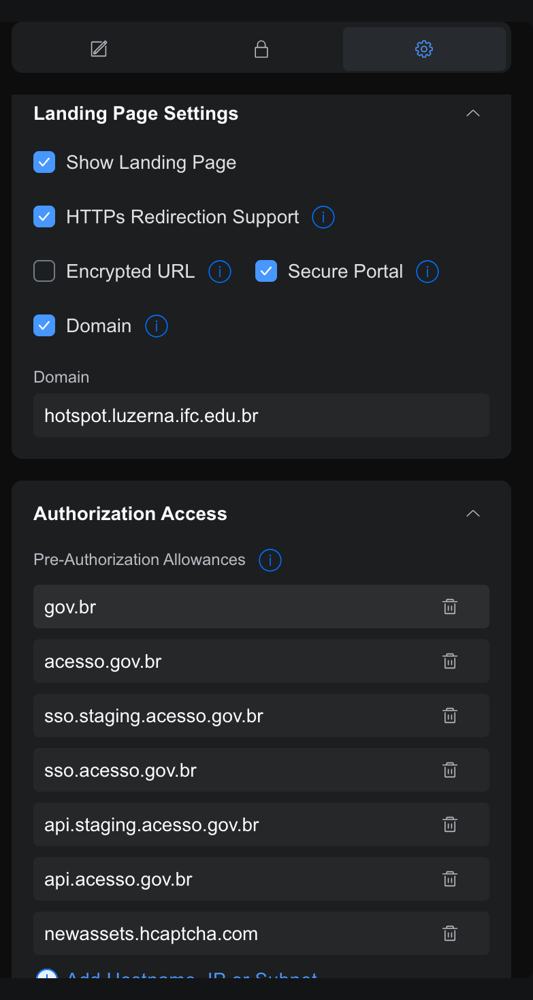
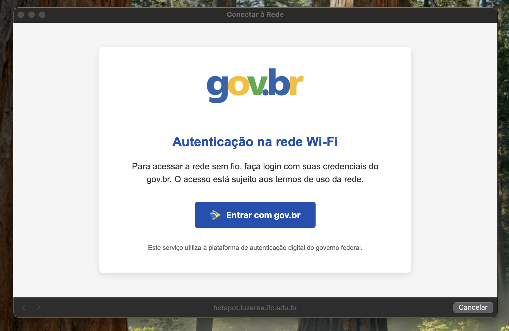
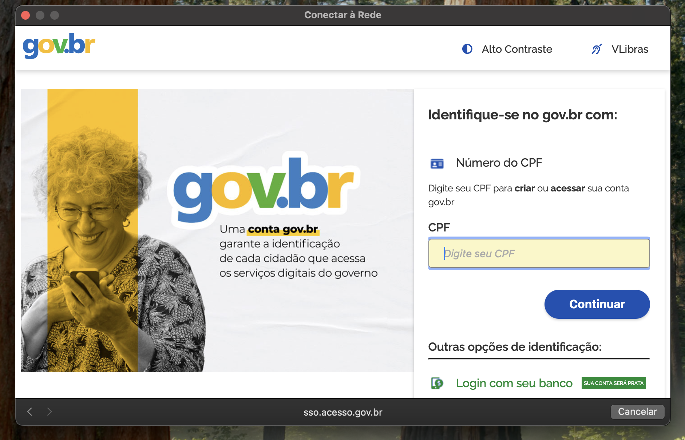
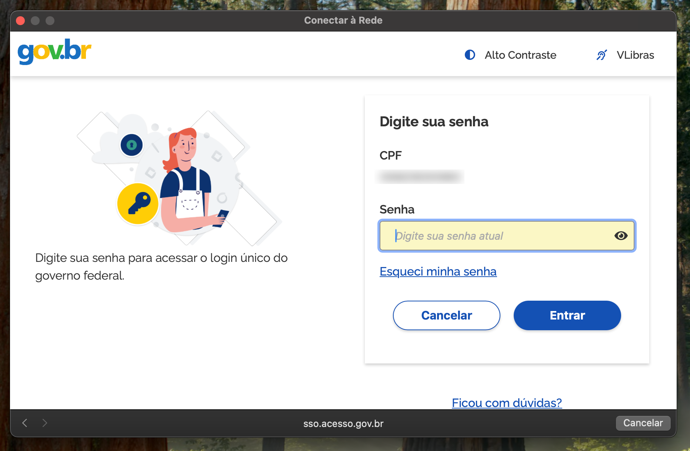
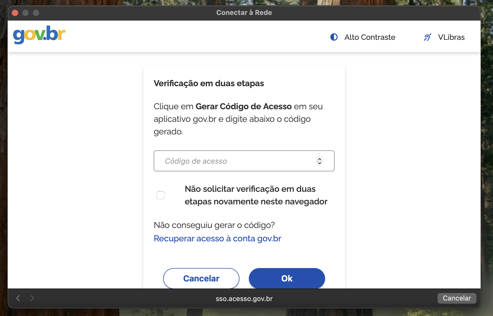
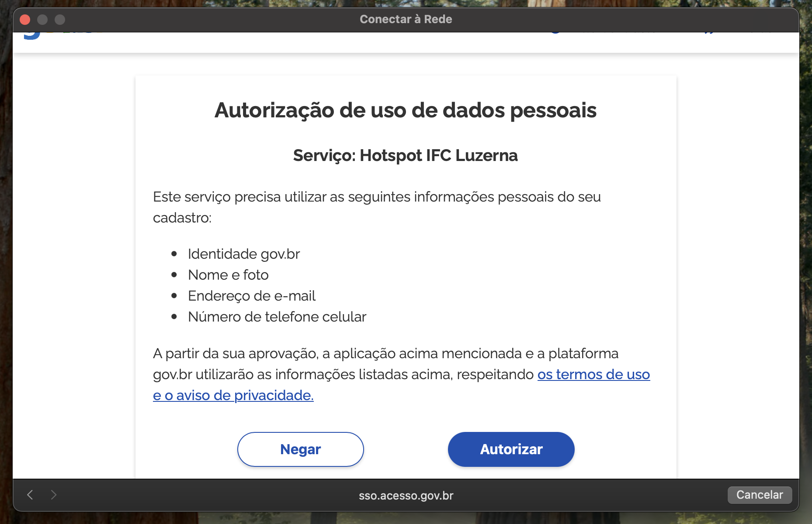
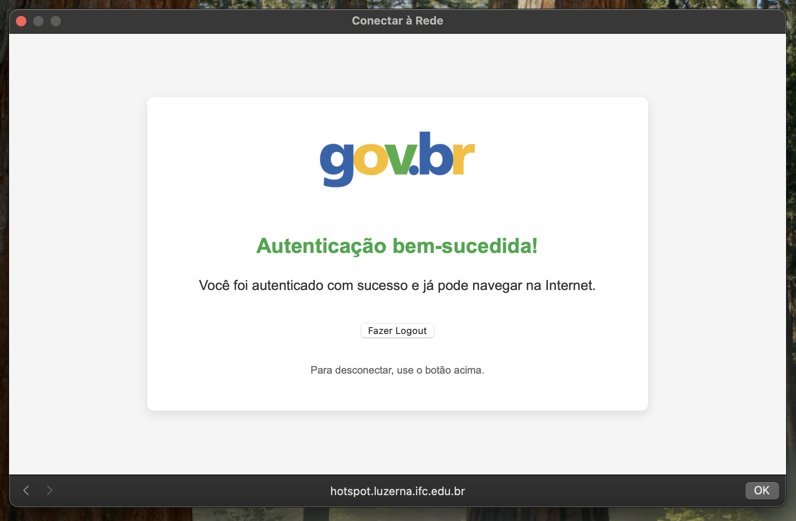

# unifi-govbr

Este projeto tem como objetivo fornecer acesso Wi-Fi por meio de um captive portal, utilizando autenticação integrada ao gov.br, em conjunto com um UniFi Network Server Controller.

A aplicação foi desenvolvida utilizando o framework [PHP Symfony](https://github.com/symfony/symfony) e faz uso da biblioteca [UniFi-API-client](https://github.com/Art-of-WiFi/UniFi-API-client) para realizar a integração com a controladora UniFi.

# Controladoras suportadas

As controladoras unifi suportadas, tanto de software como hardware, são as mesmas suportadas pela biblioteca [UniFi-API-client](https://github.com/Art-of-WiFi/UniFi-API-client).

# Requisitos

Solicitar credencial de login único (link abaixo).

As bibliotecas necessárias para rodar a aplicação estão descritas no arquivo Dockerfile.

# Links Úteis

[Solicitar Credencial do Login Único](https://www.gov.br/governodigital/pt-br/estrategias-e-governanca-digital/transformacao-digital/servico-de-integracao-aos-produtos-de-identidade-digital-gov.br)

[Passo-a-Passo para Integrar](https://acesso.gov.br/roteiro-tecnico/iniciarintegracao.html)

# Configurações na Controladora

A configuração na controladora é feita em duas etapas.

Primeiro, na aba "Authentication", é necessário definir um captive portal externo, informando o endereço onde esta aplicação estará em execução.
  

Em seguida, na aba "Settings", devem ser habilitadas as seguintes opções: "Show landing page", "HTTPS Redirection Support", "Secure Portal" e, opcionalmente, o campo "Domain".

Após essas configurações, sempre que um usuário se conectar à rede controlada pelo captive portal, ele será automaticamente redirecionado para a página de autenticação. Durante esse processo, a controladora enviará ao captive portal quatro informações: o endereço MAC do Access Point (AP) ao qual o usuário está conectado, o endereço MAC do dispositivo do usuário, a data e hora da tentativa de acesso e a URL original solicitada.

Em produção os seguintes domínios são recomendados para pré autenticação (ou seja, domínios acessíveis mesmo sem o usuário autenticar):

- gov.br
- acesso.gov.br
- sso.acesso.gov.br
- api.acesso.gov.br
- newassets.hcaptcha.com

Caso o sistema esteja em homolagação do gov.br os domínios a seguir são necessários:

- sso.staging.acesso.gov.br
- api.staging.acesso.gov.br

# Instalação

A solução é composta por dois containers: um container NGINX, que atua como proxy reverso, recebendo todas as conexões nas portas 80 e 443 e redirecionando para o container da aplicação na porta 9000. Além disso, o NGINX é responsável pelo gerenciamento dos certificados SSL do captive portal.

1) Clone o repositório: git clone https://github.com/dcc6fvo/unifi-govbr.git
2) Copie o arquivo de exemplo das variáveis de ambiente e ajuste conforme o ambiente local: cp env.sample .env
3) Adicione os certificados SSL na pasta certs.
4) Edite o arquivo nginx/hotspot.conf, ajustando o domínio, ceritificados etc etc.. conforme a necessidade do ambiente.
5) Caso necessário, faça as modificações desejadas no arquivo docker-compose.yml.
6) Por fim, execute o comando para iniciar os containers: docker compose up

# Uso

A sequência de passos a seguir demonstra o uso da aplicação desenvolvida neste repositório:

Passo 1: O usuário deve se conectar à rede Wi-Fi que foi configurada para acesso via gov.br, conforme mostra o exemplo visual do ambiente de rede:

Passo 2: Após conectar-se à rede, o usuário será redirecionado para a página inicial da aplicação, onde encontrará a opção "Logar com gov.br":

Passo 3: Em seguida, o usuário será direcionado para a página de login da plataforma gov.br, onde deverá inserir o CPF correspondente:

Passo 4: Na etapa seguinte, o usuário deverá digitar a senha de sua conta gov.br:

Passo 5: Dependendo das configurações do usuário e do navegador utilizado, poderá ser necessário realizar a autenticação em dois fatores através do aplicativo gov.br. Nesse momento, é recomendável marcar a opção "Não solicitar verificação em duas etapas novamente neste navegador":

Passo 6: Neste último passo, o usuário deverá clicar em "Autorizar" para permitir que o aplicativo de autenticação gov.br colete os dados necessários para a conexão, possibilitando uma autenticação segura e auditável. Esse passo só é necessário realizar uma única vez:

Ao final do processo, o usuário estará autenticado e com acesso liberado por um período de 240 minutos. Após esse tempo, será necessário realizar um novo login na plataforma gov.br para continuar utilizando a internet.

